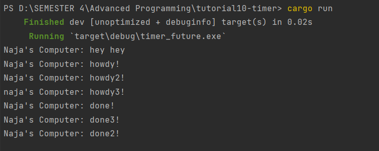
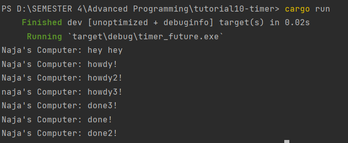

# Modul 10
**Arju Naja Muhammad (2206082045)**

### What happenned when you run the program ?

Pesan "hey hey" dicetak terlebih dahulu sebelum pesan lainnya karena instruksi `println!("Naja's Computer: hey hey")` terletak di luar tugas asinkron yang akan dieksekusi saat `executor.run()` dijalankan. Oleh karena itu, saat program utama dijalankan, instruksi `println!("Naja's Computer: hey hey")` 

Ketika kita melakukan multiple spawn, tugas akan dijalankan secara asinkron dan berjalan bersamaan. Urutan eksekusi tugas tidak dapat diprediksi; bisa jadi tugas pertama atau tugas kedua yang dieksekusi terlebih dahulu. Ini disebabkan oleh sifat asinkron dari pelaksanaan tugas, di mana tidak ada yang menentukan urutan eksekusi tugas mana yang harus diprioritaskan.

Tanpa drop, tugas akan terus berlanjut dan program tidak akan berhenti sampai tugas-tugas selesai dieksekusi. Ini disebabkan karena tugas-tugas tidak dihentikan saat program selesai dieksekusi; mereka akan berlanjut sampai tugas-tugas tersebut dihapus secara eksplisit.
