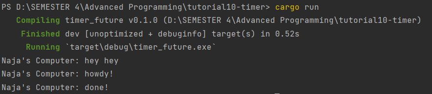

# Modul 10
**Arju Naja Muhammad (2206082045)**

### What happenned when you run the program ?

Pesan "hey hey" dicetak terlebih dahulu sebelum pesan lainnya karena instruksi `println!("Naja's Computer: hey hey")` terletak di luar tugas asinkron yang akan dieksekusi saat `executor.run()` dijalankan. Oleh karena itu, saat program utama dijalankan, instruksi `println!("Naja's Computer: hey hey")` 

